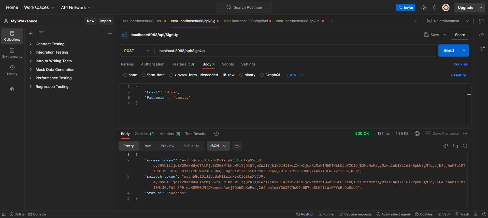
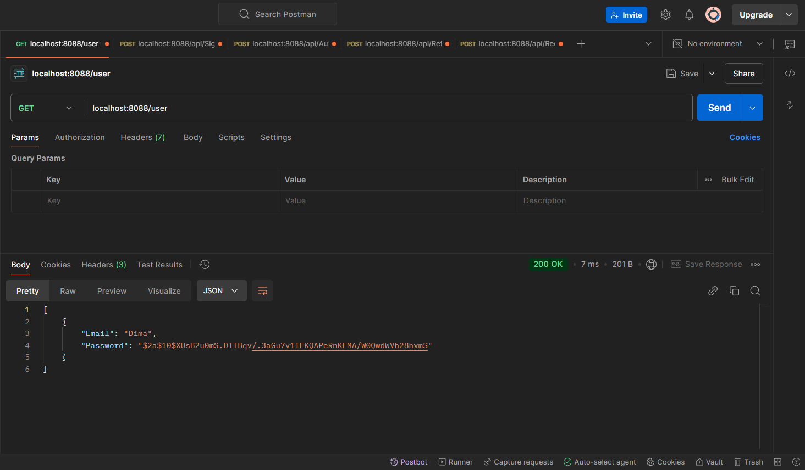
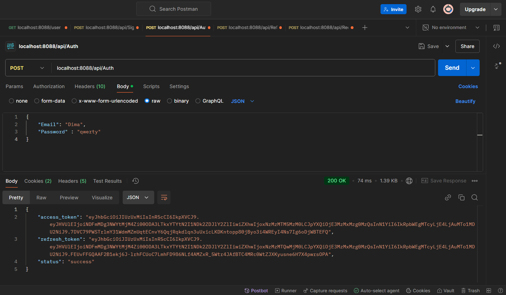
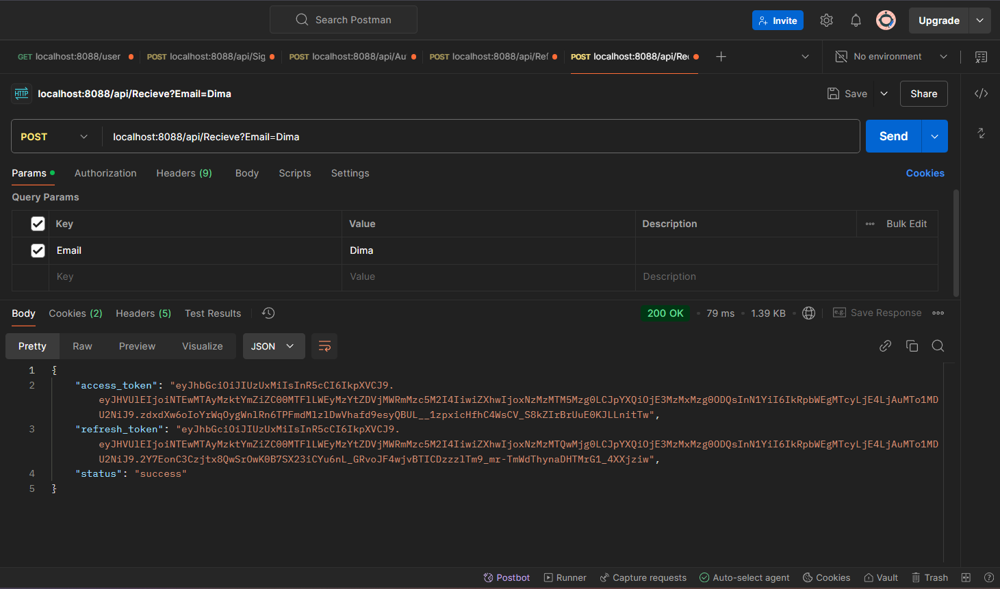
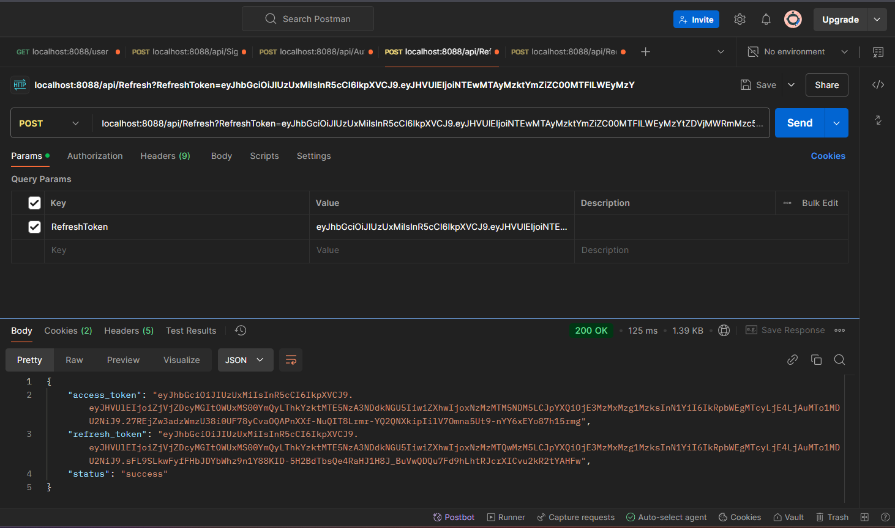
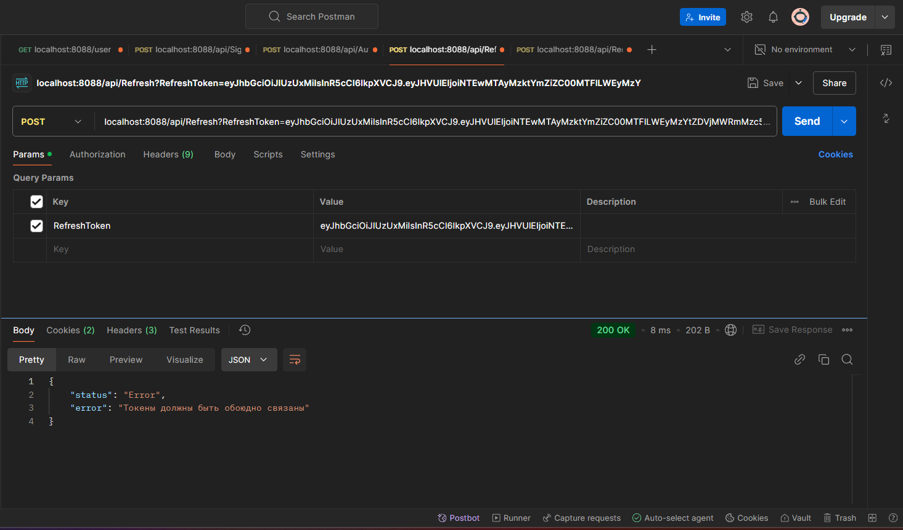
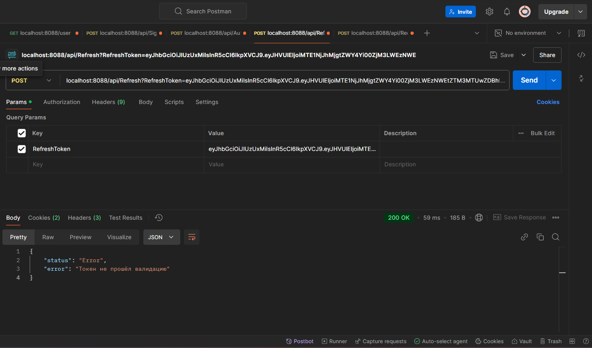
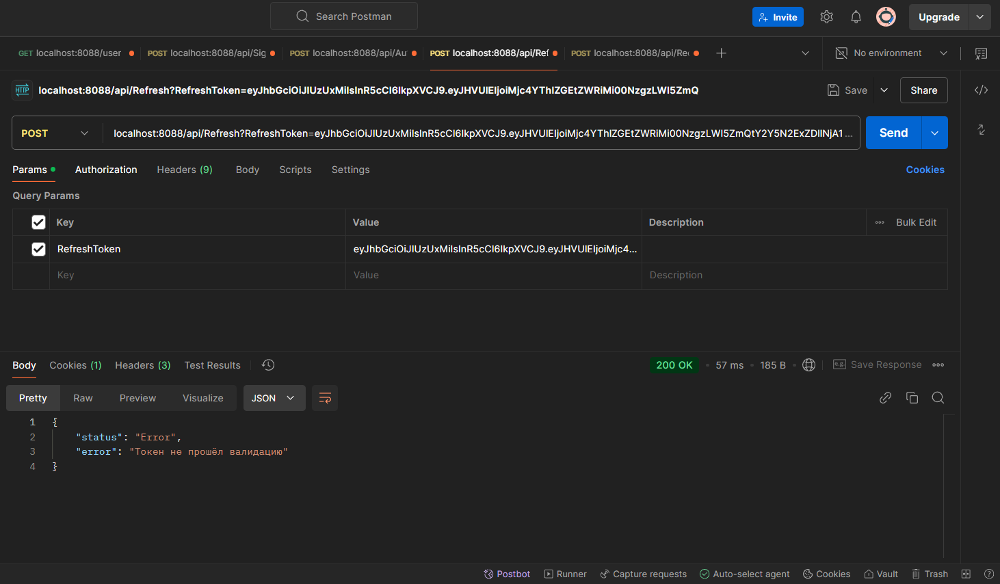

# jwt-auth

**Используемые технологии:**

- Go
- JWT
- PostgreSQL

**Задание:**

Написать часть сервиса аутентификации.

Два REST маршрута:

- Первый маршрут выдает пару Access, Refresh токенов для пользователя с идентификатором (GUID) указанным в параметре запроса
- Второй маршрут выполняет Refresh операцию на пару Access, Refresh токенов

**Требования:**

Access токен тип JWT, алгоритм SHA512, хранить в базе строго запрещено.

Refresh токен тип произвольный, формат передачи base64, хранится в базе исключительно в виде bcrypt хеша, должен быть защищен от изменения на стороне клиента и попыток повторного использования.

Access, Refresh токены обоюдно связаны, Refresh операцию для Access токена можно выполнить только тем Refresh токеном который был выдан вместе с ним.

Payload токенов должен содержать сведения об ip адресе клиента, которому он был выдан. В случае, если ip адрес изменился, при рефреш операции нужно послать email warning на почту юзера (для упрощения можно использовать моковые данные).

## Запуск
1. Запустить Docker Desktop
2. Прописать в CLI: docker compose up -d

## Реализация

Есть 5 маршрутов:
1. Вспомогательные
- 1.1 /user - Просто выводит всех юзеров
- 1.2 /api/SignUp - Регистрирует пользователя, требует ввода "Email" и "Password"
- 1.3 /api/Auth - Авторизация пользователя, требует ввода "Email" и "Password"

2. Основные
- 2.1 /api/Recieve - Выдаёт пользователю Access и Refresh токены, требует указать в параметре запроса email существующего пользователя
- 2.2 /api/Refresh - выполняет Refresh операцию на пару Access, Refresh токенов, требует указать в параметре запроса Refresh токен

## Демонстрация

1. Регистрация пользователя

2. Авторизация пользователя

3. Выдача Access и Refresh токенов

4. Refresh операцию на пару Access, Refresh токенов

### Негативные варианты

1. Попытка использовать чужой Refresh токен

2. Попытка использовать токен с неправильной подписью

3. Токен протух 
